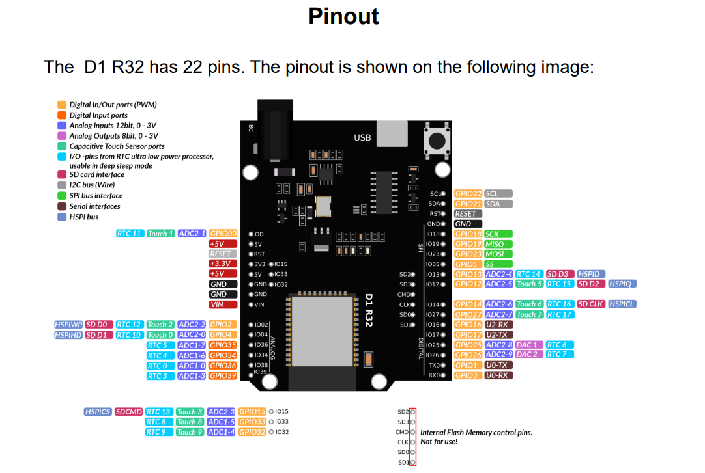

<h2>Kelompok 2</h2>

1. khoirul umam(23552011428)

2. Azmi Fauzan Alwan

3. Dianne Ramadhani (23552011364) 

<h1>Flight Black-Box Motion Recorder</h1>

  Prototipe pencatat gerakan berbasis <b>ESP32</b> dan sensor <b>BMI160</b>
  yang dapat memantau percepatan, rotasi, getaran, orientasi, benturan,
  serta kondisi jatuh bebas secara langsung.

  <b>ESP32</b> • <b>BMI160</b> • <b>OLED SSD1306</b> •
  <b>MicroSD</b> • <b>Web Dashboard</b> • <b>MQTT</b> • <b>FreeRTOS</b>

<h2>1. Gambaran Umum</h2>

Flight Black-Box Motion Recorder merupakan prototipe sederhana yang meniru sebagian
fungsi pencatatan gerakan pada black box. Alat ini menggunakan sensor BMI160 untuk
membaca percepatan dan kecepatan rotasi pada sumbu X, Y, dan Z. Data tersebut kemudian
diolah oleh ESP32 menjadi informasi G-force, getaran, roll, pitch, benturan, dan jatuh bebas.

Informasi hasil pengukuran dapat dilihat melalui layar OLED dan dashboard web.
Saat mode perekaman diaktifkan, data sensor juga disimpan ke kartu microSD dalam format CSV.
Data tertentu dapat dikirim melalui MQTT agar dapat dipantau oleh sistem lain pada jaringan lokal.

<blockquote>
Alat ini dibuat untuk pembelajaran dan pengembangan prototipe. Sistem ini bukan black box
penerbangan yang telah tersertifikasi dan tidak digunakan sebagai perangkat keselamatan utama.
</blockquote>

<h2>2. Tujuan Proyek</h2>

<ul>
  <li>Membaca percepatan dan kecepatan rotasi dari sensor BMI160.</li>
  <li>Menghitung besar G-force, getaran RMS, roll, dan pitch.</li>
  <li>Mendeteksi kejadian benturan dan jatuh bebas.</li>
  <li>Menampilkan data secara langsung pada OLED dan dashboard web.</li>
  <li>Menyimpan hasil pengukuran ke microSD dalam format CSV.</li>
  <li>Mengirim data telemetri dan kejadian melalui MQTT.</li>
  <li>Mempelajari penerapan ESP32, sensor IMU, penyimpanan data, dan Internet of Things.</li>
</ul>

<h2>3. Komponen yang Digunakan</h2>

<table>
  <thead>
    <tr>
      <th>No.</th>
      <th>Komponen</th>
      <th>Jumlah</th>
      <th>Fungsi</th>
    </tr>
  </thead>
  <tbody>
    <tr>
      <td>1</td>
      <td>Wemos D1 R32 ESP32</td>
      <td>1</td>
      <td>Membaca, mengolah, menyimpan, dan mengirim data.</td>
    </tr>
    <tr>
      <td>2</td>
      <td>Sensor BMI160</td>
      <td>1</td>
      <td>Mengukur percepatan dan kecepatan rotasi pada tiga sumbu.</td>
    </tr>
    <tr>
      <td>3</td>
      <td>OLED SSD1306 128 × 64</td>
      <td>1</td>
      <td>Menampilkan data dan status alat secara langsung.</td>
    </tr>
    <tr>
      <td>4</td>
      <td>Modul microSD</td>
      <td>1</td>
      <td>Menyimpan data hasil pengukuran dalam file CSV.</td>
    </tr>
    <tr>
      <td>5</td>
      <td>Push button</td>
      <td>1</td>
      <td>Mengganti halaman OLED dan mengaktifkan perekaman.</td>
    </tr>
    <tr>
      <td>6</td>
      <td>Active buzzer</td>
      <td>1</td>
      <td>Memberikan tanda suara untuk status dan kejadian tertentu.</td>
    </tr>
    <tr>
      <td>7</td>
      <td>Breadboard dan kabel jumper</td>
      <td>Secukupnya</td>
      <td>Menghubungkan seluruh komponen tanpa PCB.</td>
    </tr>
    <tr>
      <td>8</td>
      <td>Kabel USB</td>
      <td>1</td>
      <td>Memberi daya dari laptop sekaligus mengunggah program.</td>
    </tr>
  </tbody>
</table>

<h2>4. Koneksi Pin</h2>

<h3>Diagram Pinout dan Rangkaian</h3>

 Berikut merupakan diagram pinout dan koneksi seluruh komponen pada Flight Black-Box Motion Recorder. 

    Diagram koneksi Wemos D1 R32 ESP32, BMI160, OLED, microSD, push button, dan buzzer. 

 

<h3>BMI160 dan OLED</h3>

BMI160 dan OLED menggunakan komunikasi <b>I²C</b>. Keduanya dapat memakai jalur SDA dan
SCL yang sama karena memiliki alamat I²C yang berbeda.

<table>
  <thead>
    <tr>
      <th>Komponen</th>
      <th>Pin Komponen</th>
      <th>Pin ESP32</th>
    </tr>
  </thead>
  <tbody>
    <tr><td>BMI160</td><td>VCC</td><td>3.3V</td></tr>
    <tr><td>BMI160</td><td>GND</td><td>GND</td></tr>
    <tr><td>BMI160</td><td>SDA</td><td>GPIO 21</td></tr>
    <tr><td>BMI160</td><td>SCL</td><td>GPIO 22</td></tr>
    <tr><td>OLED SSD1306</td><td>VCC</td><td>3.3V</td></tr>
    <tr><td>OLED SSD1306</td><td>GND</td><td>GND</td></tr>
    <tr><td>OLED SSD1306</td><td>SDA</td><td>GPIO 21</td></tr>
    <tr><td>OLED SSD1306</td><td>SCL</td><td>GPIO 22</td></tr>
  </tbody>
</table>

<h3>Push Button dan Buzzer</h3>

<table>
  <thead>
    <tr>
      <th>Komponen</th>
      <th>Pin Komponen</th>
      <th>Pin ESP32</th>
    </tr>
  </thead>
  <tbody>
    <tr><td>Push button</td><td>Kaki pertama</td><td>GPIO 4</td></tr>
    <tr><td>Push button</td><td>Kaki kedua</td><td>GND</td></tr>
    <tr><td>Active buzzer</td><td>Positif</td><td>GPIO 25</td></tr>
    <tr><td>Active buzzer</td><td>Negatif</td><td>GND</td></tr>
  </tbody>
</table>

<blockquote>
Push button menggunakan mode <code>INPUT_PULLUP</code>. Tombol dianggap ditekan ketika
GPIO 4 terhubung ke GND dan terbaca LOW.
</blockquote>

<h3>Modul MicroSD</h3>

<table>
  <thead>
    <tr>
      <th>Pin MicroSD</th>
      <th>Pin ESP32</th>
    </tr>
  </thead>
  <tbody>
    <tr><td>CS</td><td>GPIO 5</td></tr>
    <tr><td>MOSI</td><td>GPIO 23</td></tr>
    <tr><td>MISO</td><td>GPIO 19</td></tr>
    <tr><td>SCK</td><td>GPIO 18</td></tr>
    <tr><td>VCC</td><td>Sesuaikan dengan spesifikasi modul</td></tr>
    <tr><td>GND</td><td>GND</td></tr>
  </tbody>
</table>

<blockquote>
Pastikan modul microSD yang digunakan aman untuk logika 3,3 V. Jangan langsung memberi
tegangan yang tidak sesuai dengan spesifikasi modul.
</blockquote>

<h2>5. Diagram Alur Sistem</h2>

<pre>
BMI160 membaca gerakan
          │
          ▼
ESP32 mengambil data pada sekitar 200 Hz
          │
          ├── Menghitung G-force
          ├── Menghitung besar rotasi
          ├── Menghitung getaran RMS
          ├── Menghitung roll dan pitch
          ├── Mendeteksi free fall dan impact
          ├── Menampilkan data pada OLED
          ├── Menyimpan data ke microSD
          ├── Menyediakan dashboard web
          └── Mengirim telemetri melalui MQTT
</pre>

<h2>6. Cara Kerja Alat</h2>

<ol>
  <li>BMI160 membaca percepatan dan kecepatan rotasi pada sumbu X, Y, dan Z.</li>
  <li>Data dikirim ke ESP32 melalui komunikasi I²C.</li>
  <li>Nilai sensor dikurangi dengan offset hasil kalibrasi.</li>
  <li>ESP32 menghitung G-force total dan besar kecepatan rotasi.</li>
  <li>Getaran dihitung menggunakan nilai RMS dari perubahan percepatan terhadap 1 g.</li>
  <li>Roll dan pitch dihitung menggunakan gabungan data accelerometer dan gyroscope.</li>
  <li>Nilai pengukuran dibandingkan dengan ambang untuk mendeteksi benturan dan jatuh bebas.</li>
  <li>Data ditampilkan pada OLED dan dikirim ke dashboard web.</li>
  <li>Jika perekaman aktif, data disimpan ke microSD dalam file CSV.</li>
  <li>Telemetri dikirim melalui MQTT setiap sekitar satu detik.</li>
</ol>

<h2>7. Data yang Diukur</h2>

<table>
  <thead>
    <tr>
      <th>Data</th>
      <th>Penjelasan Sederhana</th>
      <th>Satuan</th>
    </tr>
  </thead>
  <tbody>
    <tr>
      <td>ax, ay, az</td>
      <td>Percepatan pada sumbu X, Y, dan Z.</td>
      <td>g</td>
    </tr>
    <tr>
      <td>gx, gy, gz</td>
      <td>Kecepatan rotasi pada sumbu X, Y, dan Z.</td>
      <td>dps</td>
    </tr>
    <tr>
      <td>NowG</td>
      <td>Besar percepatan total yang diterima alat.</td>
      <td>g</td>
    </tr>
    <tr>
      <td>GyroAbs</td>
      <td>Besar kecepatan rotasi total dari ketiga sumbu.</td>
      <td>dps</td>
    </tr>
    <tr>
      <td>Vibration RMS</td>
      <td>Tingkat getaran yang diterima alat.</td>
      <td>g</td>
    </tr>
    <tr>
      <td>Roll</td>
      <td>Kemiringan alat ke kiri atau kanan.</td>
      <td>derajat</td>
    </tr>
    <tr>
      <td>Pitch</td>
      <td>Kemiringan alat ke depan atau belakang.</td>
      <td>derajat</td>
    </tr>
    <tr>
      <td>Impact</td>
      <td>Kejadian saat percepatan total melewati batas benturan.</td>
      <td>kejadian</td>
    </tr>
    <tr>
      <td>Free fall</td>
      <td>Kejadian saat percepatan total sangat rendah dalam waktu tertentu.</td>
      <td>kejadian</td>
    </tr>
  </tbody>
</table>

<h2>8. Perhitungan Utama</h2>

<h3>G-force Total</h3>

<pre>
G-force = √(ax² + ay² + az²)
</pre>

Saat alat diam pada permukaan datar, nilai G-force umumnya mendekati 1 g karena pengaruh gravitasi.

<h3>Kecepatan Rotasi Total</h3>

<pre>
Gyro total = √(gx² + gy² + gz²)
</pre>

<h3>Getaran RMS</h3>

Getaran dihitung dari perubahan G-force terhadap kondisi normal 1 g. Nilai tersebut dikuadratkan,
dirata-ratakan dalam 64 sampel, kemudian diakarkan. Semakin besar nilai RMS, semakin kuat getaran
yang diterima alat.

<h3>Roll dan Pitch</h3>

Roll dan pitch dihitung menggunakan <i>complementary filter</i>. Data gyroscope digunakan untuk
mengikuti perubahan gerakan dengan cepat, sedangkan accelerometer membantu mengurangi penyimpangan
nilai dalam penggunaan yang lebih lama.

<h2>9. Deteksi Kejadian</h2>

<table>
  <thead>
    <tr>
      <th>Kejadian</th>
      <th>Ketentuan pada Program</th>
      <th>Arti</th>
    </tr>
  </thead>
  <tbody>
    <tr>
      <td>Free fall</td>
      <td>G-force di bawah 0,25 g selama minimal 30 ms</td>
      <td>Alat mengalami kondisi percepatan sangat rendah seperti saat jatuh bebas.</td>
    </tr>
    <tr>
      <td>Impact</td>
      <td>G-force sama dengan atau lebih besar dari 2,5 g</td>
      <td>Alat menerima benturan atau perubahan gerakan yang kuat.</td>
    </tr>
  </tbody>
</table>

<blockquote>
Nilai ambang 0,25 g dan 2,5 g merupakan pengaturan pada program, bukan batas universal.
Nilainya dapat disesuaikan kembali berdasarkan objek, posisi sensor, dan hasil pengujian.
</blockquote>

<h2>10. Fungsi Push Button</h2>

<table>
  <thead>
    <tr>
      <th>Penggunaan Tombol</th>
      <th>Fungsi</th>
    </tr>
  </thead>
  <tbody>
    <tr>
      <td>Tekan singkat</td>
      <td>Berpindah ke halaman OLED berikutnya.</td>
    </tr>
    <tr>
      <td>Tekan dan tahan sekitar 1,2 detik</td>
      <td>Mengaktifkan atau menghentikan perekaman data ke microSD.</td>
    </tr>
    <tr>
      <td>Ditahan saat ESP32 dinyalakan</td>
      <td>Menjalankan kalibrasi accelerometer dan gyroscope.</td>
    </tr>
  </tbody>
</table>

<h2>11. Tampilan OLED</h2>

OLED memiliki 11 halaman yang dapat dipindahkan menggunakan tombol:

<ol>
  <li><b>Summary</b>: ringkasan G-force, rotasi, getaran, nilai puncak, dan status rekaman.</li>
  <li><b>Accel</b>: grafik perubahan percepatan terhadap 1 g.</li>
  <li><b>Gyro</b>: grafik besar kecepatan rotasi.</li>
  <li><b>Vibration</b>: grafik getaran RMS.</li>
  <li><b>Orientation</b>: indikator roll dan pitch.</li>
  <li><b>Peaks A</b>: nilai maksimum dan minimum G-force serta getaran maksimum.</li>
  <li><b>Peaks B</b>: nilai rotasi maksimum, minimum, dan benturan terakhir.</li>
  <li><b>Events</b>: jumlah free fall, impact, dan waktu sejak kejadian terakhir.</li>
  <li><b>Status</b>: status Wi-Fi, MQTT, microSD, rekaman, nama file, dan alamat IP.</li>
  <li><b>Diag A</b>: alamat BMI160, frekuensi pembacaan, ax, dan ay.</li>
  <li><b>Diag B</b>: az, gx, gy, gz, G-force, dan besar rotasi.</li>
</ol>

Sensor dibaca sekitar 200 kali per detik, sedangkan OLED diperbarui sekitar 20 kali per detik
agar komunikasi I²C tidak terlalu terbebani.

<h2>12. Perekaman Data ke MicroSD</h2>

Perekaman dapat diaktifkan melalui tekan lama pada push button atau melalui dashboard web.
Setiap sesi perekaman membuat file baru secara otomatis di folder <code>/logs</code>.

<pre>
/logs/LOG0001.csv
/logs/LOG0002.csv
/logs/LOG0003.csv
</pre>

Isi file CSV terdiri dari:

<pre>
timestamp_ms,ax,ay,az,gx,gy,gz,roll,pitch,event,status
</pre>

<table>
  <thead>
    <tr>
      <th>Kolom</th>
      <th>Isi</th>
    </tr>
  </thead>
  <tbody>
    <tr><td>timestamp_ms</td><td>Waktu sejak ESP32 menyala dalam milidetik.</td></tr>
    <tr><td>ax, ay, az</td><td>Percepatan pada tiga sumbu.</td></tr>
    <tr><td>gx, gy, gz</td><td>Kecepatan rotasi pada tiga sumbu.</td></tr>
    <tr><td>roll, pitch</td><td>Sudut kemiringan alat.</td></tr>
    <tr><td>event</td><td>Tanda <code>FREEFALL</code>, <code>IMPACT</code>, atau <code>-</code>.</td></tr>
    <tr><td>status</td><td>Status saat baris direkam. Pada alur program saat ini nilainya tercatat sebagai <code>REC</code>.</td></tr>
  </tbody>
</table>

Program melakukan <i>flush</i> data setiap 50 baris untuk mengurangi risiko kehilangan data
apabila daya terputus secara tiba-tiba.

<h2>13. Dashboard Web</h2>

ESP32 menjalankan web server lokal pada port 80. Dashboard dapat dibuka melalui alamat IP
ESP32 menggunakan laptop atau telepon seluler yang berada pada jaringan Wi-Fi yang sama.

Dashboard dapat digunakan untuk:

<ul>
  <li>Melihat data sensor dan orientasi secara langsung.</li>
  <li>Melihat nilai maksimum, minimum, dan jumlah kejadian.</li>
  <li>Mengaktifkan atau menghentikan perekaman.</li>
  <li>Menghapus nilai puncak dan penghitung kejadian.</li>
  <li>Melihat daftar file log pada microSD.</li>
  <li>Mengunduh file CSV melalui browser.</li>
  <li>Melihat status Wi-Fi, MQTT, microSD, perekaman, dan waktu operasi alat.</li>
</ul>

<h3>Endpoint Web</h3>

<table>
  <thead>
    <tr>
      <th>Endpoint</th>
      <th>Metode</th>
      <th>Fungsi</th>
    </tr>
  </thead>
  <tbody>
    <tr><td><code>/</code></td><td>GET</td><td>Membuka halaman dashboard.</td></tr>
    <tr><td><code>/data</code></td><td>GET</td><td>Mengambil data telemetri dalam format JSON.</td></tr>
    <tr><td><code>/record/toggle</code></td><td>POST</td><td>Mengaktifkan atau menghentikan perekaman.</td></tr>
    <tr><td><code>/peaks/reset</code></td><td>POST</td><td>Menghapus nilai puncak dan jumlah kejadian.</td></tr>
    <tr><td><code>/logs</code></td><td>GET</td><td>Menampilkan daftar file log.</td></tr>
    <tr><td><code>/download?file=LOG0001.csv</code></td><td>GET</td><td>Mengunduh file CSV tertentu.</td></tr>
  </tbody>
</table>

<h2>14. Indikator Buzzer</h2>

<table>
  <thead>
    <tr>
      <th>Pola Bunyi</th>
      <th>Arti</th>
    </tr>
  </thead>
  <tbody>
    <tr><td>1 bunyi</td><td>Alat berhasil menyala atau perekaman dimulai.</td></tr>
    <tr><td>2 bunyi</td><td>Perekaman dihentikan atau free fall terdeteksi.</td></tr>
    <tr><td>3 bunyi</td><td>Impact terdeteksi atau terjadi kesalahan sensor/microSD.</td></tr>
  </tbody>
</table>

Durasi bunyi untuk kejadian dapat berbeda, tetapi jumlah bunyi digunakan sebagai indikator utama.

<h2>15. Pembagian Tugas dengan FreeRTOS</h2>

Agar proses pembacaan sensor tidak terganggu oleh jaringan atau buzzer, program membagi pekerjaan
menjadi beberapa tugas FreeRTOS.

<table>
  <thead>
    <tr>
      <th>Task</th>
      <th>Core</th>
      <th>Pekerjaan</th>
    </tr>
  </thead>
  <tbody>
    <tr>
      <td><code>TaskSensor</code></td>
      <td>Core 1</td>
      <td>Membaca BMI160, menghitung data, mendeteksi kejadian, memperbarui OLED, dan menyimpan log.</td>
    </tr>
    <tr>
      <td><code>TaskNetwork</code></td>
      <td>Core 0</td>
      <td>Menangani Wi-Fi, web server, MQTT, dan push button.</td>
    </tr>
    <tr>
      <td><code>TaskBuzzer</code></td>
      <td>Core 0</td>
      <td>Menjalankan pola buzzer tanpa menghentikan tugas lain.</td>
    </tr>
  </tbody>
</table>

Mutex digunakan untuk mencegah beberapa task mengakses I²C, microSD, atau data telemetri
pada saat yang sama.

<h2>16. Struktur Folder</h2>

<pre>
Flight-Black-Box/
├── main.ino atau main.cpp
├── webpage.h
└── README.md
</pre>

<ul>
  <li><code>main.ino</code> atau <code>main.cpp</code>: program utama pembacaan sensor, OLED, microSD, Wi-Fi, MQTT, dan FreeRTOS.</li>
  <li><code>webpage.h</code>: halaman HTML dashboard yang disimpan di dalam program ESP32.</li>
  <li><code>README.md</code>: dokumentasi proyek.</li>
</ul>

<h2>17. Konfigurasi Sebelum Upload</h2>

Ubah konfigurasi berikut sesuai jaringan yang digunakan:

<pre>
const char* WIFI_SSID     = "NAMA_WIFI";
const char* WIFI_PASSWORD = "PASSWORD_WIFI";

const char* MQTT_HOST = "IP_BROKER_MQTT";
const uint16_t MQTT_PORT = 1883;
const char* MQTT_USER = "USERNAME_MQTT";
const char* MQTT_PASS = "PASSWORD_MQTT";
</pre>

<blockquote>
Jangan menyimpan nama Wi-Fi, password, atau kredensial MQTT asli di repository GitHub publik.
Gunakan data contoh, file konfigurasi terpisah, atau GitHub Secrets bila diperlukan.
</blockquote>

<h2>18. Kalibrasi Sensor</h2>

<ol>
  <li>Matikan atau lepaskan daya ESP32.</li>
  <li>Letakkan alat pada permukaan yang datar dan jangan digerakkan.</li>
  <li>Tekan dan tahan push button.</li>
  <li>Nyalakan ESP32 sambil tetap menahan tombol.</li>
  <li>Tunggu hingga layar menampilkan <code>Calib Done</code>.</li>
  <li>Lepaskan tombol dan gunakan alat seperti biasa.</li>
</ol>

Program mengambil 200 sampel untuk menentukan offset accelerometer dan gyroscope.
Hasil kalibrasi disimpan di NVS sehingga tidak perlu dilakukan setiap kali alat dinyalakan.

<h2>19. Keterbatasan</h2>

<ul>
  <li>Alat belum menggunakan GPS, sehingga belum mencatat lokasi.</li>
  <li>Waktu pada file masih menggunakan waktu sejak ESP32 menyala, bukan tanggal dan jam sebenarnya.</li>
  <li>Dashboard dan MQTT bergantung pada ketersediaan jaringan Wi-Fi lokal.</li>
  <li>Nilai roll dan pitch dapat dipengaruhi oleh getaran dan gerakan translasi yang kuat.</li>
  <li>Ambang free fall dan impact perlu disesuaikan dengan objek yang dipantau.</li>
  <li>Penyimpanan microSD dapat gagal apabila kartu, catu daya, atau sambungan SPI tidak stabil.</li>
  <li>Sistem belum memenuhi standar keselamatan dan sertifikasi perangkat penerbangan.</li>
</ul>

<h2>20. Referensi</h2>

Konsep awal proyek mengacu pada artikel
<a href="https://how2electronics.com/flight-black-box-motion-recorder-using-esp32-bmi160/">
Flight Black-Box Motion Recorder System Using ESP32 &amp; BMI160
</a> dari How2Electronics. Dokumentasi ini telah disesuaikan dengan program yang menggunakan
Wemos D1 R32 ESP32, OLED, push button, buzzer aktif, microSD, dashboard web, MQTT, dan FreeRTOS.

  
<b>Proyek Mikrokontroler dan Internet of Things</b>

